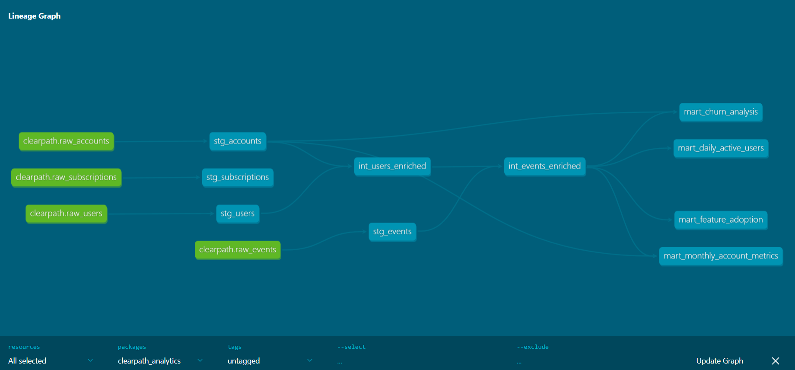

# Clearpath Analytics — dbt SaaS Analytics Project

A production-style dbt analytics project modeling SaaS business metrics for a fictional B2B project management tool called Clearpath. Built to demonstrate analytics engineering fundamentals including multi-layer data modeling, testing, documentation, and lineage.

---

## Demo



---

## What It Models

Four raw data sources flow through three modeling layers to produce business-ready analytical tables.

**Raw sources**
- `raw_accounts` - 200 B2B customer accounts with plan, MRR, and churn status
- `raw_users` - 1,579 users across those accounts with roles and login history
- `raw_events` - 14,220 user activity events across 10 event types
- `raw_subscriptions` - subscription and billing records per account

**Staging layer** - cleans and standardizes each raw source independently. Renames columns, casts data types, adds simple derived fields.

**Intermediate layer** - joins staging models to create enriched datasets. Users enriched with account context. Events enriched with user and account context.

**Marts layer** - business-ready analytical tables that answer real product and revenue questions.

---

## Mart Models

**mart_daily_active_users**
Daily active user counts by plan and industry. Tracks engagement trends and product stickiness over time.

**mart_monthly_account_metrics**
Monthly rollup of account level engagement. Source of truth for MAU, feature usage, projects created, tasks completed, and members invited per account per month.

**mart_feature_adoption**
Feature level usage metrics per account. Shows which features each account uses, how frequently, and how many users engage with each feature. Used to identify expansion signals and churn risk.

**mart_churn_analysis**
Account level churn analysis combining subscription status with engagement signals. Derives a health status for each account - healthy, at_risk, low_engagement, or churned - based on recency and activity patterns.

---

## Testing

27 data tests across all layers covering uniqueness, not null constraints, accepted values, and referential integrity between models.
```bash
dbt test
```

---

## Project Structure
```
clearpath_analytics/
├── models/
│   ├── staging/
│   │   ├── sources.yml
│   │   ├── schema.yml
│   │   ├── stg_accounts.sql
│   │   ├── stg_users.sql
│   │   ├── stg_events.sql
│   │   └── stg_subscriptions.sql
│   ├── intermediate/
│   │   ├── int_users_enriched.sql
│   │   └── int_events_enriched.sql
│   └── marts/
│       ├── schema.yml
│       ├── mart_daily_active_users.sql
│       ├── mart_monthly_account_metrics.sql
│       ├── mart_feature_adoption.sql
│       └── mart_churn_analysis.sql
├── generate_data.py
└── README.md
```

---

## How To Run

**Prerequisites**
- Python 3.8+
- dbt-duckdb

**Setup**
```bash
python -m venv venv
source venv/bin/activate
pip install dbt-duckdb faker duckdb
```

**Configure profiles.yml**

Add the following to `~/.dbt/profiles.yml`:
```yaml
clearpath_analytics:
  target: dev
  outputs:
    dev:
      type: duckdb
      path: "path/to/your/clearpath.duckdb"
      schema: main
      threads: 4
```

**Generate synthetic data**
```bash
python generate_data.py
```

**Run dbt**
```bash
dbt run
dbt test
dbt docs generate
dbt docs serve
```

---

## Synthetic Data

All data is completely fabricated using Python and the Faker library. No real company or user information was used. The dataset was designed to reflect realistic SaaS business patterns including plan distribution, user engagement, feature adoption, and churn rates.

---

## Stack

- dbt-duckdb
- DuckDB
- Python with Faker and pandas for synthetic data generation

---

## Author

Ethan Hale
[github.com/ehale06](https://github.com/ehale06) | [linkedin.com/in/ethan-hale06](https://linkedin.com/in/ethan-hale06)
